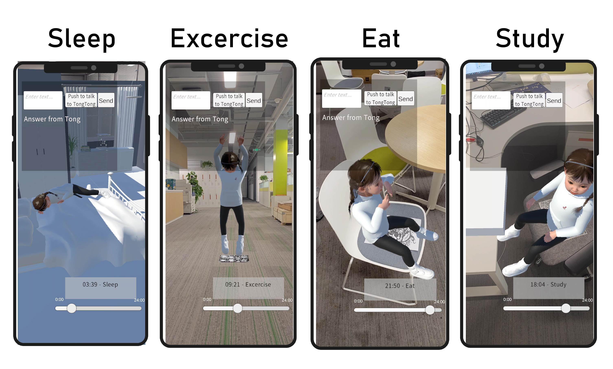
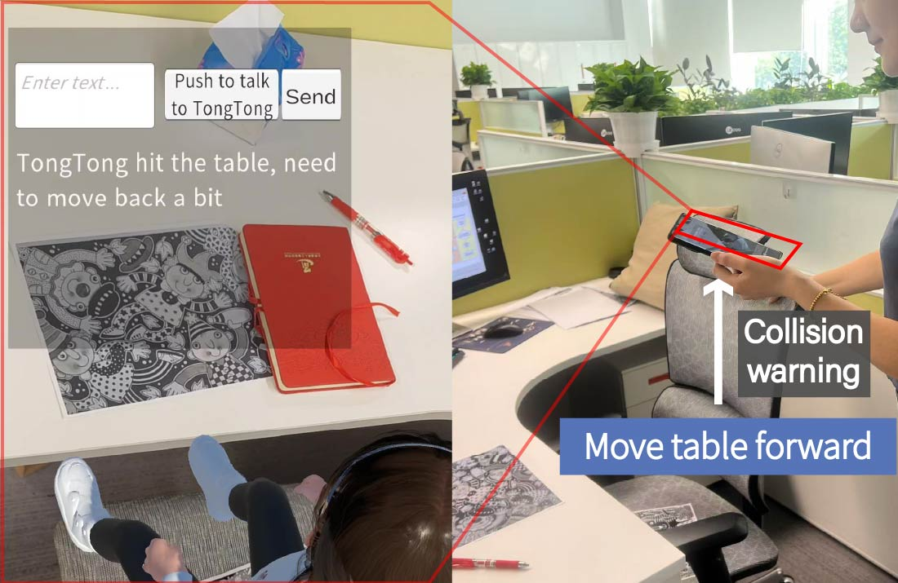
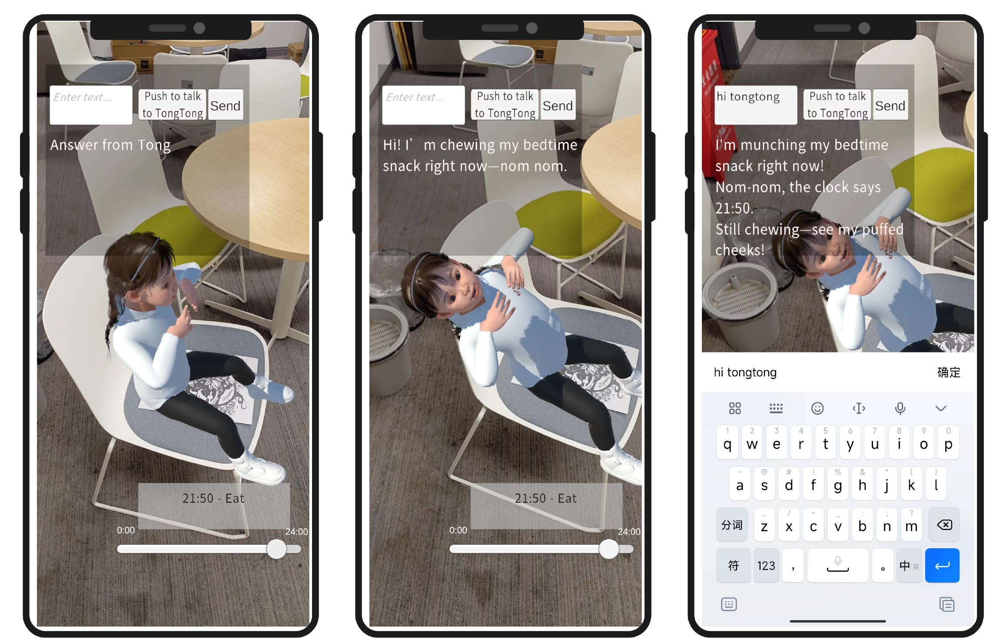
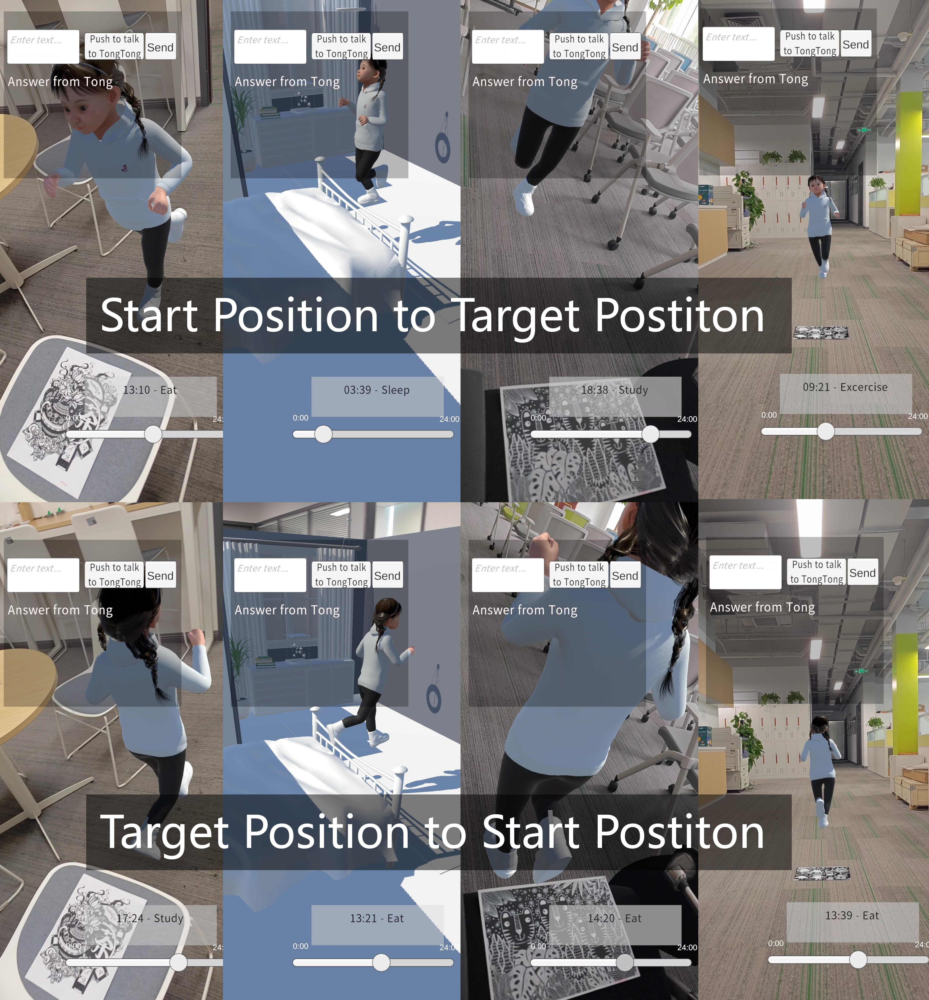

# Virtual Human as Living Partner: Mobile Augmented Reality Companion

This repository contains the code and assets for the **Virtual Human as Living Partner** project, a mobile augmented reality (AR) system that brings a virtual human into the user's physical environment. Through timeline-based state scheduling and by aligning the camera to pre-calibrated markers, the system dynamically instantiates, animates, and locates the virtual human in real space. The goal is to transform this agent into a living companion that provides continuous presence, context-aware behavior, and interactive companionship. For a specific demo, please refer to the **Virtual Human as Living Partner.mp4** file in the project.

## State Generation  
  
The system matches the timeslider and marker to generate the virtual human's states at different time periods.

## Collision Warning  
  
When the virtual human collides with the marked object, the system displays a screen prompt and optionally plays a sound alert.

## Communication and Animation  
  
Voice communication with the virtual human is captured via the microphone, while the animation controller adjusts the head and spine directions for eye contact.

## Smooth Entry and Exit  
  
Smooth transitions in and out of the scene.
